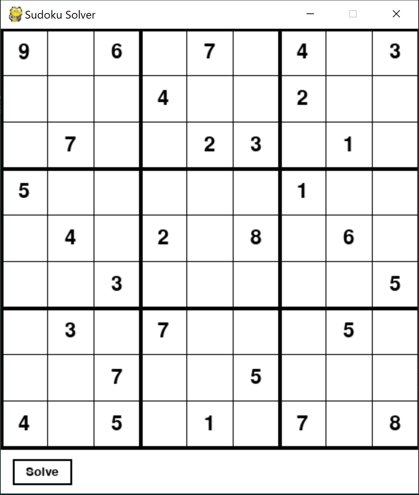
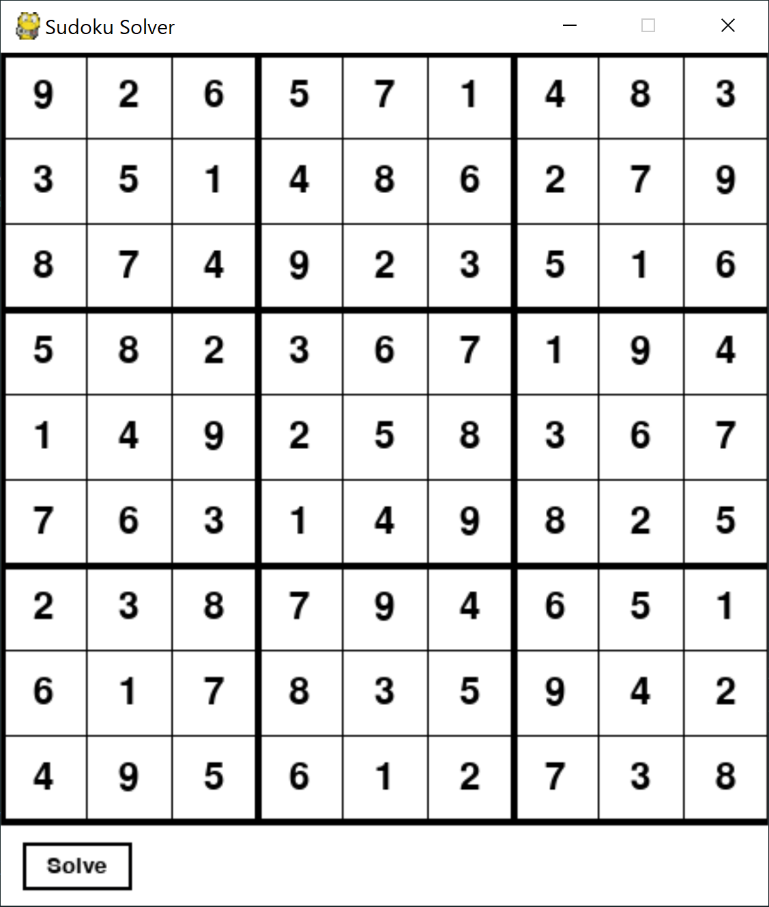

# Sudoku Solver

This project uses a back-tracking algorithm to solve the Sudoku puzzle. The user is greeted by a gui window, built with pygame, which contains a sudoku grid. Initially, this grid is filled with a sample puzzle, like so:

The user can manually select any of the cells by simply clicking on them and changing the value. Any digit from 1 to 9 can be typed into a cell, inclusive. Typing 0 clears the cell. All other keys are ignored. Once the input puzzle has been entered, the user can click on the solve button to obtain a solution to the puzzle, where the values of the solution are automatically filled into the grid, as follows:

**NOTE**: I will be futher updating this to improve the overall functionality and user experience.
